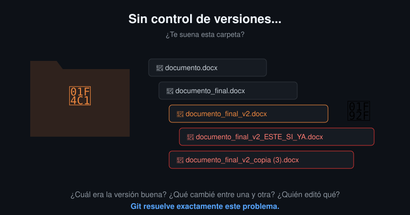
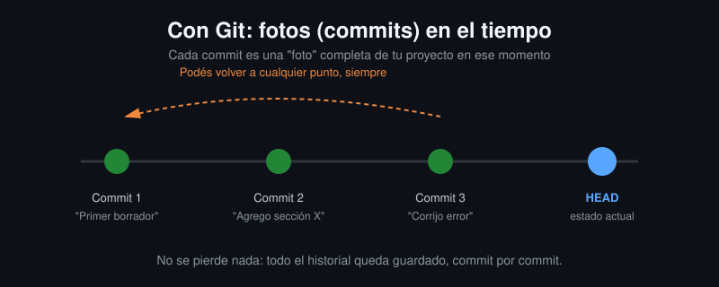
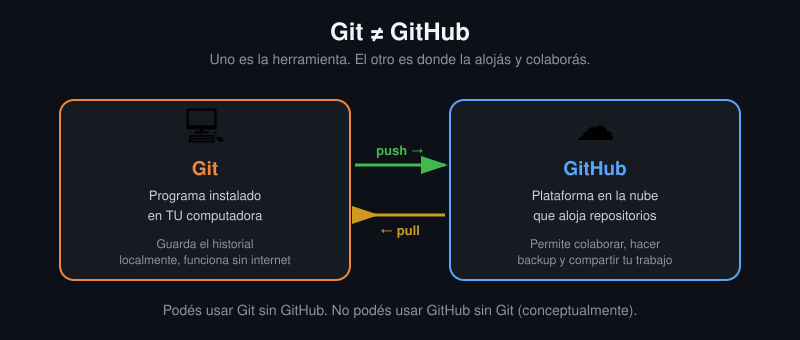

# Lección 01: ¿Qué es Git y por qué existe?

## 🎯 Objetivos de aprendizaje

Al terminar esta lección vas a poder:
- Explicar qué problema real resuelve el control de versiones.
- Distinguir con claridad qué es **Git** y qué es **GitHub** (no son lo mismo).
- Entender el concepto de **commit** como una "foto" del proyecto en un momento dado.
- Navegar el historial de un repositorio real en GitHub sin escribir un solo comando.

## ✅ Prerrequisitos

Ninguno. Esta lección es 100% conceptual — todavía no vamos a instalar nada ni abrir la terminal. Eso llega en la Lección 04.

## 🤔 ¿Por qué esto importa?

Seguro viviste esto alguna vez: escribís un documento, lo modificás, no estás seguro si el cambio fue bueno, y terminás con una carpeta así:

Nadie sabe cuál es la versión "buena", qué cambió entre una y otra, ni cómo volver atrás sin perder trabajo. Esto no es solo un problema de estudiantes editando una tesis — es exactamente el mismo problema que tiene un equipo de 50 personas escribiendo código para un sistema en producción. Si no lo resolvés con una herramienta pensada para esto, lo vas a "resolver" a mano, mal, y tarde o temprano vas a perder algo importante.

**Git existe para eliminar este problema de raíz.**

## 📖 Contenido

### ¿Qué es el control de versiones?

Es la práctica de llevar un registro de todos los cambios que hace un archivo (o un proyecto entero) a lo largo del tiempo, de forma que en cualquier momento puedas:

- Ver qué cambió, cuándo y quién lo hizo.
- Volver a una versión anterior sin perder las versiones posteriores.
- Trabajar en paralelo con otras personas sobre el mismo proyecto sin pisarse.

Git es, hoy, la herramienta de control de versiones más usada del mundo — no solo para código: también se usa para versionar infraestructura (Terraform, Kubernetes), documentación, e incluso libros.

### El concepto clave: el commit

A diferencia de simplemente "guardar" un archivo (`Ctrl+S`), Git no guarda un archivo suelto — guarda una **foto completa de todo tu proyecto** en ese instante. A esa foto se la llama **commit**.

Cada commit queda guardado para siempre (salvo que decidas explícitamente borrarlo). Esto significa que **nunca vas a perder trabajo por error** — siempre podés volver a cualquier punto anterior del historial. De esto hablamos con más profundidad en la Lección 08, pero quedate con la idea: *Git es una máquina del tiempo para tu proyecto.*

### Git no es GitHub (y esto confunde a casi todo el mundo al principio)

Esta es, probablemente, la confusión más común de cualquier persona que arranca con esto — así que vamos a dejarla clara desde el día 1:

- **Git** es un programa que corre en tu computadora. Guarda el historial de commits localmente. Podés usar Git sin internet, sin cuenta, sin GitHub.
- **GitHub** es una plataforma web (una empresa, de hecho, propiedad de Microsoft) que aloja repositorios de Git en la nube, y agrega funcionalidades de colaboración: Pull Requests, Issues, revisión de código, Actions (CI/CD), etc.

Existen alternativas a GitHub (GitLab, Bitbucket) que también usan Git por debajo — porque **Git es el estándar**, y estas plataformas son distintas formas de alojarlo y colaborar sobre él.

> 💡 Analogía simple: Git es como el motor de un auto. GitHub es el auto completo, con volante, asientos y GPS, construido *alrededor* de ese motor.

### ¿Por qué arrancamos sin terminal?

En las próximas dos lecciones (02 y 03) vas a crear tu primer repositorio, hacer tu primer commit y hasta manejar ramas — **todo desde la interfaz web de GitHub**, sin escribir un solo comando. La terminal la vamos a sumar recién en la Lección 04, cuando ya tengas los conceptos claros. Así separamos dos problemas distintos: primero entender *qué* está pasando, después aprender *cómo* escribirlo por comandos.

## 🧪 Práctica

Ver [`practica.md`](./practica.md) — en esta lección la práctica es de exploración, no de creación: vas a navegar el historial de commits de un repositorio público real.

## 🚀 Reto opcional

Buscá en GitHub algún repositorio de un proyecto open source que uses o conozcas (por ejemplo, uno de VS Code, Python, o cualquier librería que te suene) y mirá su pestaña de "Commits". Fijate hace cuánto tiempo tiene historial, y cuántos commits acumuló. Te va a dar una idea real de la escala en la que se usa esta herramienta en proyectos serios.
